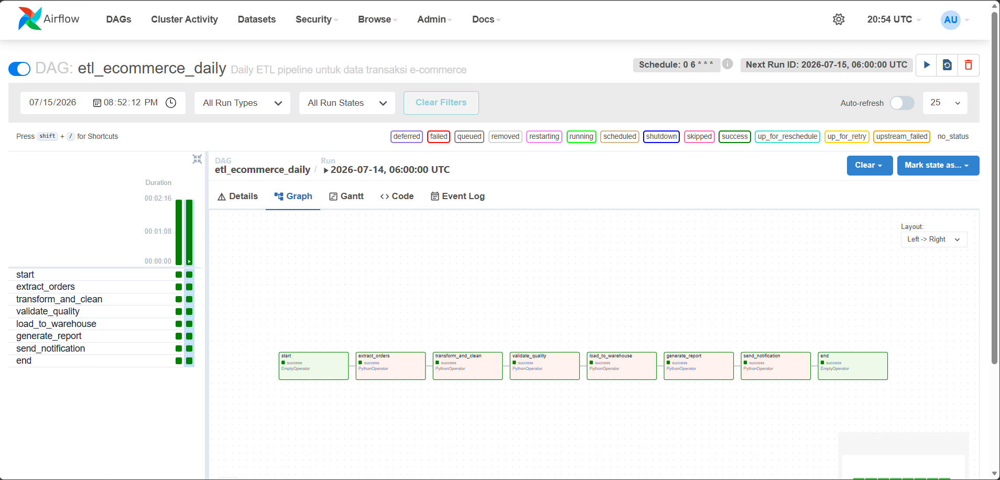

# ETL Pipeline Design: E-Commerce Orders

## 1. Overview

Pipeline ini memproses data transaksi e-commerce harian untuk kebutuhan pelaporan bisnis. Pipeline dijalankan menggunakan **Apache Airflow** yang dideploy dalam container untuk memastikan lingkungan eksekusi yang konsisten.

## 2. Extract

* **Sumber**: Data mentah (CSV) yang diletakkan pada direktori lokal `./data`.

* **Format**: File `.csv` yang berisi detail order per transaksi.

* **Volume**: Proses dirancang untuk menangani beban data transaksi harian (incremental).

## 3. Transform

* **Langkah 1 (Transform & Clean)**: Pembersihan data mentah, menangani missing values, dan penyeragaman format data.

* **Langkah 2 (Validate)**: Melakukan validasi kualitas data untuk memastikan skema dan integritas data sesuai sebelum dimuat ke warehouse.

## 4. Load

* **Tujuan**: Data Warehouse (Target: BigQuery).

* **Format output**: Tabel terstruktur yang siap digunakan untuk analisis BI dan pelaporan.

## 5. Orchestration

* **Tool**: Apache Airflow 2.10.0 (Python 3.11).

* **Schedule**: Dijalankan setiap hari pukul 06:00 pagi (`0 6 * * *`).

* **DAG flow**:

`Start` → `Extract` → `Transform` → `Validate` → `Load` → `Report` → `Notify` → `End`.

## 6. Error Handling

* **Skenario 1 (Kegagalan Task)**: Menggunakan konfigurasi `retries: 3` dengan jeda 5 menit antar percobaan untuk menangani kegagalan sementara (*flaky tasks*).

* **Skenario 2 (Notifikasi)**: Jika pipeline gagal setelah melewati batas *retry*, sistem akan mengirimkan notifikasi email otomatis ke `alert@company.com`.

## 7. Monitoring

* **Cara tahu pipeline sukses**: Melalui UI Apache Airflow (port 8080) dengan memantau status `Success` (berwarna hijau) pada setiap task di dalam DAG `etl_ecommerce_daily`.

* **Cara tahu data berkualitas**: Melalui fungsi `validate_quality` yang bertindak sebagai *gatekeeper*. Jika validasi gagal, pipeline akan terhenti dan notifikasi akan dikirim untuk mencegah data rusak masuk ke Warehouse.
